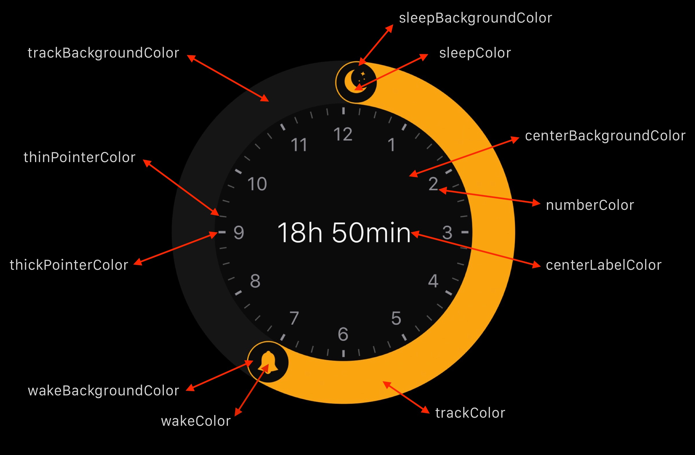

## BedtimeClock

My sketches for iOS 10 bedtime clock. **Unfinished**.


### Init

```swift
// Time jumps at each five minutes

let bedtimeClockView: BedtimeClockView = BedtimeClockView(
    frame: CGRect(x: 0, y: 0, width: 320, height: 320),
    startTimeInMinutes: 126, // Hour: 02:06, will display 02:05
    endTimeInMinutes: 552 // Hour: 09:12, will display 09:10
)
```

### Observer

Watch the changes using this snippet:

```swift
self.bedtimeClockView.observer = { start, end, durationInMinutes in

    print(start, end, durationInMinutes) // Will print: 01:00, 09:00, 480

}
```

### Palette

You can change the colors whenever you want. Let's say if you want to give an impression of enabling and disabling the clock. To do so, use this function:

```swift
// Change nil for the color of your choice
 
self.bedtimeClockView.changePalette(
    trackBackgroundColor = nil,
    centerBackgroundColor = nil,
    wakeBackgroundColor = nil,
    wakeColor = nil,
    sleepBackgroundColor = nil,
    sleepColor = nil,
    trackColor = nil,
    numberColor = nil,
    thickPointerColor = nil,
    thinPointerColor = nil,
    centerLabelColor = nil
)
```
See below the full color reference:



## License

BedtimeClock is released under the MIT license. See [LICENSE](https://github.com/leocardz.com/BedtimeClock/blob/master/LICENSE) for details.
